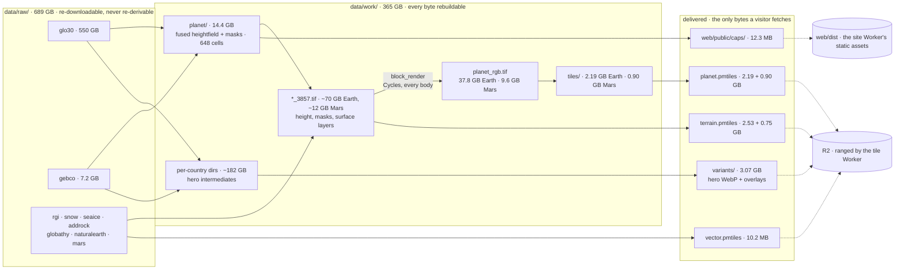

# Storage inventory

The **current** map of on-disk data stores: what each is, who reads it, whether it is reclaimable.

- **At a glance**, measured 2026-09-03:

| | size | |
|---|---|---|
| free | **405 GB** | of a 1.8 TB ext4 root, 77% used |
| `data/raw/` | **689 GB** | sources, re-downloadable, never re-derivable |
| `data/work/` | **365 GB** | intermediates, every byte rebuildable |
| `blender/renders/` | **27.9 GB** | the hero products |
| `web/public/caps/` | **12.3 MB** | the only rendered assets inside the site build |

- **This file is maintained, not a snapshot: re-measure when the chain moves, and if a row and the
  disk disagree, the row is the bug.** Past states live in git history; reclaim passes and their
  lessons live in HISTORY.
- Four gitignored stores hold everything above, and no assets or DEM data are in git.
  `web/public/caps/` is gitignored at `web/.gitignore:26`.

## The chain, from download to browser

- **Organised by BYTES, which is this file's axis and nothing else's.**
  `docs/pipeline-overview.mmd` draws the same chain as a process and `PROCESS.md` draws it as stage
  timings; neither says what is on disk or who can delete it. Read this one to find a store, those
  to find a stage.
- **The dashed edges are the only ones that leave the box, and they have two destinations.** The
  three archives and the hero store go to R2; the caps alone ride inside the site build. Everything
  left of that line is local and rebuildable, and a raw source is the sole thing that cannot be
  re-derived, only re-downloaded.
- **Two rasters fuse and no others.** Every other layer is warped onto the render grid by the planet
  warp stage, which is why a finer re-fuse would not have to redo any of them.

- **THE CHAIN HAS NO FORK.** Every body's colour raster is rendered by `block_render` in Cycles.
  There was a per-body field choosing between that and a numpy compositor; the field, the compositor
  and the `planet_producer.json` that recorded which one ran are deleted rather than parked. Each
  recipe still names its own producer as a literal, so a second one arriving cannot inherit the
  first's freshness.
- **The caps branch at the FUSION and never touch the render grid.** `cap_sources` warps AEQD from
  the planet VRTs, so the caps share no warped intermediate and no pyramid with the tiles they
  feather into. What couples them is the recipe rather than a file: both sides record the same look
  constants, so a look change restages both, and nothing else would keep them from drifting apart at
  the seam.

## Raw sources: `data/raw/` (689 GB)

| Store | Size | What it is | Used by | Reclaim? |
|---|---|---|---|---|
| `glo30/` | 550 GB | Copernicus GLO-30 land DEM tiles (downloaded per-country, on demand) | fusion (heroes + planet) | Keep: any re-fuse, new country, or z9/z10 extension reads it; largest store on the box |
| `worldcover/` | 114 GB | ESA WorldCover 2021 (class-70 permanent snow/ice) | **hero snow only** (`render/snow_mask.py`), NOT the tile pipeline | **The largest single reclaim available, and it is gated on a decision rather than on a measurement**: it retires only if the heroes also migrate to the tile snow source |
| `mars/` | 11.4 GB | Two whole-planet downloads, no per-tile machinery. `Mars_HRSC_MOLA_BlendDEM_Global_200mp_v2.tif` (11,384,463,908 B, 106694 x 53347 int16) is the heightfield. `Mars_Viking_ClrMosaic_global_925m.tif` (797,888,177 B, 23059 x 11530 RGB) is the field Mars's polar ice alpha is graded from, and `mars_ice.ALPHA_LEVELS` was measured over these exact bytes | the DEM feeds `fuse/relabel_mars.py`; the mosaic feeds `mars/ice/` | Keep the DEM: re-downloadable, but a ~23 min single-stream fetch with its edition pinned by size and Last-Modified. The mosaic re-fetches byte-identically in ~90 s against the publisher's md5, so deleting it costs a re-fetch rather than nothing |
| `gebco/` | 7.2 GB | GEBCO 2026 bathymetry / ice-surface | fusion (heroes + planet); Caspian bathymetry | Keep |
| `rgi/` | 2.6 GB | RGI 7.0 glaciers, **all 19 regions** (merged `rgi7_g_3857.gpkg` 1.1 GB + source shp) | tile snow (`look/snow.py`) | Keep |
| `snow/` | 1.6 GB | NSIDC-0791 snow-persistence climatology | tile snow (`look/snow.py`) | Keep |
| `cop30_void/` | 1.1 GB | Cop30 void-fill DEM | fusion void-fill | Keep |
| `seaice/` | 640 MB | OSI SAF OSI-450-a monthly EASE2 files + the derived 1991-2020 ice-frequency climatology + native `freq_{nh,sh}_ease2.tif` | tile sea ice (`look/seaice.py`) + both caps | Keep (climatology is tiny); `monthly/` regenerable from anonymous THREDDS |
| `addrock/` | 410 MB | SCAR ADD rock outcrop: zip + unzipped shp + the reprojected `add_rock_3857.gpkg` | Antarctic ice subtraction, tiles + block + south cap | Keep the gpkg; the unzipped shp regenerates from the zip, and the zip from `acquire/download_add_rock.py` |
| `naturalearth/` | 38 MB | NE vectors (borders, framing polygons, coastline oracle) | framing, borders, countries/boundary GeoJSON | Keep (tiny) |

## Work / intermediates: `data/work/` (365 GB)

| Store | Size | What it is | Reclaim? |
|---|---|---|---|
| `planet_tiles/` | **112 GB** | Earth's tile-pyramid build: itemised below | Mixed: see breakdown |
| per-country dirs (205 of them) | **~182 GB** | **Hero render intermediates** (DEM mosaics, warps, masks per country) | **The second-largest reclaim, also gated on a decision**: they are the input to any future re-render (a new country, a look change, the next `render_prep` fix) |
| `mars/` | **32.7 GB** | The second body's whole work tree, itemised below | Mixed: see breakdown |
| `globathy/` | 15.0 GB | GLOBathy extracted: `rasters/` = **83,357** per-lake 1-arcsecond TIFFs (~15 GB, 83 k inodes) + `lakedepth.vrt` | Keep: the VRT is the lake-depth warp's only dependency, and the raw zips it came from are gone, so this IS the store now (re-downloadable via `acquire.download_globathy`, pinned md5) |
| `planet/` | 14.4 GB | Fused planet heightfield + masks, **648 cells** of 10 degrees (36 lon x 18 lat, pole to pole), five files per cell | Keep: input to the tiler |
| `planet_terrain/` | **5.07 GB** | Terrain-RGB (Tier 3 displacement), built by `tile/terrain_rgb.py` from `height_3857.tif`. Now exactly two things: the shipping pyramid `bathy_s8_webp/tiles/` (2.53 GB, 87,381 tiles, z0-8, stamped `tiles.done` + `terrain_params.json`) and its archive `terrain.pmtiles` (2.53 GB) | Keep both. The `elev_z0..z7` downsample chain that used to live in `bathy_s8_webp/work/` is reclaimed; it re-derives from `height_3857.tif` on the next cut and costs ~17 GB transiently while it does |
| `cap/` | **3.25 GB** | Earth's cap intermediates: the AEQD warps, the full-size `cap_{north,south}.tif`, the freshness sidecars, the prepped `render_{north,south}/` (0.39 GB) and the 28 Cycles frames per pole in `frames_{north,south}/` (0.93 GB), plus ~0.5 GB of superseded A/B discs (`cap_*_raytraced82.tif`, `ab_ice_damp`, `ab_pole_taper`, `ab_prod`) | Mixed. The render dirs and frames are kept on purpose: they make a stopped render cost one frame instead of the ring. The A/B discs are decision records whose decisions have landed. Budget **>=16 G** for any re-render: the stage peaks ~14.4 GiB |
| `borders/` | 21 MB | `countries.geojson` + `boundary_lines.geojson` (NE to GeoJSON emitters), served at `/borders/` | Keep (tiny); regenerable from `naturalearth/` |
| `planet_vector/` | **10.2 MB** | Earth's VECTOR tiles (MVT), cut by `compose/countries_pmtiles.py` from `borders/countries.geojson` plus the two layers it derives. One archive, three source-layers (`country_fill`, `country_outline`, `country_hit`), z0-8, stamped `countries_tiles_params.json`. **Three orders of magnitude smaller than the raster pyramids**: it is geometry, not pixels | Keep. Re-cuts from `countries.geojson` in **17 s**; the recipe sidecar is what makes a settings change visible, since the filename cannot carry one |
| `_profile_tiles/` · `_profile_pass/` · `_profile_mars_tiles/` · `_profile_tiles_earth_z8/` | 41 MB | `pass.log` (stage timings) + `samples.jsonl` per run label. `samples.jsonl` is rewritten every run; `pass.log` is ROTATED to `pass-<timestamp>.log`, because a producer that resumes across nights would otherwise keep only the last night's record of which blocks failed | **Keep: the source of every number in PROCESS.md.** These are the four directories a reclaim must never sweep along with their leading-underscore siblings |
| `_*/` experiment scratch | 0 now | A/B and investigation output, by convention leading-underscore | **Reclaim as soon as the decision lands in HISTORY**: the finding is the product, the pixels are not |

### `planet_tiles/` breakdown (Earth, 112 GB)

- **Itemised deliberately**: summarising this directory in one line is how ~43 GB of dead
  generations once hid, and a *deferred* measurement of a growing directory is the same failure as a
  stale one.
- Steady state is **one live pyramid and no rollback**. `build_tiles` auto-rotates `tiles/` to
  `tiles_old/` on each cut, so a rollback returns at the next one and auto-reclaims at the one
  after. The window is one cut deep, never one producer deep.
- **THE COMPOSITE PYRAMID DOES NOT EXIST LOCALLY, and `tiles_old` is not a stand-in for it.** A
  composite arm is the only control for judging what the producer switch changed, and rotation
  destroys it silently: the directory is the right size and the wrong contents, so an `ls` says
  nothing. It survives in R2 as the deployed `planet-v2.pmtiles`, and as **64 z8 tiles in
  `~/terrella-scratch/cap-join/composite/`, which is the only local copy and must not be reclaimed**
  while the polar disc is open.
- `pack_pmtiles.py` emits an intermediate `planet.mbtiles` that `pmtiles convert` reads:
  **transient by design**, currently absent, and it rebuilds from `tiles/` in ~10 s.

| File | Size | What it is | Reclaim? |
|---|---|---|---|
| `height_3857.tif` + `.done` | 43.2 GB | planet heightfield on the WMQ 3857 grid (131072 squared, Float32, full Mercator extent incl. Antarctica) | Keep: every block is cut from it, and it is the terrain-RGB lane's source too |
| `planet_rgb.tif` + `.done` | **37.8 GB** | the approved look at the full 131072-squared grid, which the tiles are cut from. Written by `block_render`, the only producer, and `raytrace_params.json` beside it is what says so | Keep: `--tiles` reads it |
| `seaice_3857.tif` + `.done` | 17.4 GB | OSI SAF ice-frequency climatology warped ONCE to the 3857 grid, raw packed Float32, in latitude bands (a coarse 25 km source decimates under a single whole-grid warp); read in window slices, ocean-gated | Keep: regenerable, dep is `seaice_frequency_1991-2020_4326.tif` |
| `snow_persistence_3857.tif` + `.done` | 9.03 GB | NSIDC-0791 persistence warped ONCE to the 3857 grid, raw packed Float32, in 256-row latitude bands; read in window slices | Keep: regenerable, dep is `snow/*.nc` |
| `planet.pmtiles` | **2.19 GB** | the serving archive (`pmtiles convert`, capped, `--tmpdir` on ext4): spec v3, clustered, z0-8 | Keep: the deployment artifact; ~10 s + ~7 s to rebuild from `tiles/` |
| `tiles/` | **2.19 GB** | **LIVE and APPROVED**: the ratified look (z0-8, **87,381** tiles, 512 px WebP q95) | Keep (live) |
| `lakedepth_3857.tif` + `.done` | 318 MB | GLOBathy lake depth on the 3857 grid (~98% zero, deflates small). Its `.done` is what stops a pass paying that ~1 h warp again; only dep is `lakedepth.vrt` | Keep |
| `water_3857.tif` / `ocean_3857.tif` + `.done` | 81 MB | 3857 masks; `water_3857` reads class 1 at the Caspian | Keep |
| `glacier_3857.tif` + `.done` | 30 MB | RGI 7.0 glacier mask (Byte 0/1) rasterized ONCE to the 3857 grid; exact vector burn, so no banding needed | Keep: regenerable, dep is `rgi7_g_3857.gpkg` |
| `addrock_3857.tif` + `.done` | 30 MB | SCAR rock outcrop on the 3857 grid, the Antarctic ice subtraction | Keep: regenerable, dep is `add_rock_3857.gpkg` |
| `raytrace_params.json`, `tile_params.json`, `relief_params.json` | ~7 KB | materialised palette/knob params: **the freshness guards' dependency records** | Keep (regenerated; **mtime is load-bearing**) |
| `index.html` | 2.6 KB | **tile SMOKE TEST, not the product globe**: proves the raw pyramid renders with only `python -m http.server`, so broken tiles and a broken frontend can be told apart (labelled in-page after being mistaken for the product once) | Keep: a *different tool*, and gitignored means deleting is permanent |
| `tmp/` | ~0 | `pmtiles convert --tmpdir` home (ext4, not tmpfs): self-cleans on normal exit | Keep the dir |

### `mars/` breakdown (32.7 GB)

Nested under its own prefix where Earth's stages sit un-prefixed at the root. `planet/` is 12 KB: a
CRS-relabelled VRT over the raw blend plus its seam declaration, no copy of the 11 GB.

| File | Size | What it is | Reclaim? |
|---|---|---|---|
| `planet_tiles/height_3857.tif` | 10.9 GB | the 65536-squared 3857 grid every block is cut from | Keep: live, the raytraced producer reads it per block |
| `planet_tiles/planet_rgb.tif` | 9.64 GB | the colour master at 65536 squared. **The raytraced cut shrank the archive and grew the master**, both measured: the composite wrote 4.1 GB to this path and its archive was 1.40 GB, because raytraced tiles carry less fine detail for WebP to spend bytes on while the master is a lossless three-band render | Keep: `--tiles` reads it |
| `planet_tiles/ice_{north,south}_{field,lapc,apu}.tif` | **3.00 GB** | the six polar ice-alpha intermediates: the graded Viking brightness field per pole, and the two USGS mapped units burnt to raster. `ice_north_*` is 2.53 GB of it, the north unit being far the larger | Reclaimable: they re-derive from `mars/ice/viking_luma_4326.tif` and the two SIM 3292 GeoJSONs, and their sidecars make a re-run a skip |
| `planet_tiles/planet_composite_ARCHIVE.pmtiles` | 1.30 GB | a hand-kept copy of the superseded composited archive | **Reclaimable, and the decision is one-way**: its producer is deleted, so this can never be regenerated. Nothing in the repo reads it |
| `planet_tiles/planet.pmtiles` | 0.90 GB | the deployment artifact for the z7 cut | Keep |
| `planet_tiles/tiles/` | 0.90 GB | **21,845** tiles, z0-7 | Keep until R2 holds a second copy of the archive |
| `planet_tiles/snow_persistence_3857.tif` | 0.71 GB | **not Earth's snow.** It is `perennial_ice`'s warped basename, which Mars is the one body to declare, and the registry is what says so | Keep: named by the live layer set |
| `cap/` | 2.91 GB | both poles' AEQD warps, the Viking luma warps, the discs, the prepped `render_{north,south}/` (0.42 GB) and the 28 frames per pole in `frames_{north,south}/` (1.18 GB) | Keep: `MARS.renders_polar_caps` is `True`, so the planet pass refreshes these on every run. A south cap re-render is a measured **22.2 min** (PROCESS) |
| `planet_terrain/` | 1.50 GB | the z7 terrain pyramid (0.75 GB, 21,845 tiles) and its archive (0.75 GB) | Keep both |
| `_ice_white/` | 643 MB | the AEQD warps and burnt unit GeoJSONs that `scripts/measure_mars_ice_white.py` caches | Reclaimable: a re-run re-warps them, and the `.done` markers make an unchanged re-run a skip |
| `ice/` | 205 MB | `viking_luma_4326.tif`: the Viking mosaic collapsed to one Float32 brightness band on a 4326 grid covering the whole sphere, which is the field BOTH ice tiers grade against, beside the two VRTs that reach it. Whole-planet on purpose though only the poles are read: a polar crop would save ~160 MB and cost a crop latitude whose failure is ice quietly missing at the band edge | Keep: a 45 s rebuild from the raw mosaic, and the sidecar makes a re-run a skip. `mars_ice.ALPHA_LEVELS` is four percentiles OF THIS FILE, so rebuilding it on a different grid means re-measuring them |
| `features/` · `planet_vector/` | 33 MB | nomenclature labels and the vector cut | Keep (tiny) |

## Hero products: `blender/renders/` (27.9 GB)

The only heavy store outside `data/`, gitignored the same way. Listed here because an unlisted store
is an unaudited one: a 26 GB dead rollback archive lived here unnoticed.

| Store | Size | What it is | Reclaim? |
|---|---|---|---|
| `heroes/` incl. `heroes/raw/` | 24.2 GB | `raw/` is the un-post-processed Cycles frames, one 8K PNG per country; beside it the shaded finals (raw + `sky_view`) | Keep: `sky_view` re-shades finals from `raw/` with **no GPU re-render** (the AO retune took 203 countries off them in minutes), and the finals are what `hero_variants` encodes from |
| `variants/` | **3.07 GB** | **the served store**: 1,243 hero WebP (6 rungs, q85 to 1920 / q95 above, + a per-country portrait fill rung on 25 of them) and 1,243 spotlight overlays | Keep: this is what the browser fetches. The 1,010 `*-border-*.png` rungs that used to sit here are gone, in R2 as well as on disk |
| `archive/` | 595 MB | one-off look experiments (india/nepal/swiss look v1-v3): the visual record behind ART's decisions | Keep (small); **not** a place for rollback trees |
| `*.log`, `batch_failures*.jsonl` | <10 MB | sweep logs + the failure roster batch retries from | Keep (tiny) |

- **Rollback archives are the trap here.** A pre-sweep `cp -al` hardlink tree costs ~0 bytes *until*
  the sweep re-renders, then every hardlink breaks into real bytes and the archive silently becomes
  a full second copy. Prune it the day the sweep ratifies.

## What the browser loads (dev vs prod)

- The wire view: which stores actually reach a visitor, and how dev differs from the deploy target.
  Dev serves stores through three routes in `web/astro.config.ts`: two pointed by `web/.env`
  (`HERO_STORE` to `blender/renders/variants`, `BORDERS_STORE` to `work/borders`) and `/tiles`,
  whose archives are derived from the work tree itself, rooted at `MAPS_DATA`. The deploy target is
  Cloudflare: a **site Worker** serving `web/dist` as static assets (`web/wrangler.jsonc`, *not*
  Pages), R2 for the hero store, and a **separate tile Worker** for tiles. The site addresses all
  three through `web/src/lib/assetBase.ts`, whose defaults are the same-origin dev paths.
- The build (`web/dist/`, **20.2 MB**, 209 pages) contains **only markup and code**: every heavy
  asset stays in its store and is fetched at runtime, so `pnpm build` never copies gigabytes.

| Asset | Wire size (prod, gz) | Dev | Prod | Store |
|---|---|---|---|---|
| globe JS chunk (MapLibre + the **bundled** `countries.json` manifest: an import, never a fetch) | 280 KB (1.08 MB raw) | vite, unminified, larger | edge gzip/brotli | `web/dist/_astro/` |
| page CSS | **inlined into every document** (`build.inlineStylesheets: 'always'`), so it costs document bytes and no request: 12 KB on the globe, 5 KB on the gallery, uncompressed | dev injects it as `<style>` via Vite instead, which is a different cascade order | same | in the HTML |
| MapLibre's stylesheet | 70 KB raw, a **non-blocking** `<link media="print">` promoted on load: it styles widgets that cannot exist until the globe chunk has run | same link; dev *also* injects it as `<style>`, so it loads twice | same | `web/dist/_astro/maplibre-gl.*.css` |
| small chunks (polarCaps, capability probe) | ~3 KB total | same | same | `web/dist/_astro/` |
| relief tiles | **26.2 KB avg/tile on Earth** (2.19 GB / 87,381), **43.2 KB on Mars** (0.90 GB / 21,845), viewport-driven | `/tiles/{body}/relief/{token}/{z}/{x}/{y}.webp`, ranged out of the archive by the dev middleware | same URL shape, ranged by the Worker out of R2: measured, first paint ~40 requests | `planet_tiles/planet.pmtiles` |
| polar caps | the 8192 rung is **Mars 3.18 + 2.95 MB** and **Earth 1.09 + 0.79 MB** (north + south); the 4096 rung mobile takes is Mars 0.99 + 0.98, Earth 0.43 + 0.28. Plus `caps.json`, fetched eagerly at globe load, revalidated not cached; decode off-thread | identical | identical: WebP ships pre-compressed | `web/public/caps/` |
| `boundary_lines.geojson` | 0.55 MB gz (1.95 MB raw): **opt-in only**, fetched on the first Borders toggle-on, never by default | uncompressed | edge gzip/brotli | `work/borders/` |
| country vector tiles | **4 tiles, 175 KB brotli** in the cold window at the default camera (z1 covers the globe; 22-65 KB each, largest 122 KB raw), viewport-driven like the relief tiles | `/tiles/earth/vector/{token}/{z}/{x}/{y}.mvt`, ranged by the dev middleware, identity bytes | same URL shape, ranged by the Worker out of R2; edge-compressed as text | `planet_vector/vector.pmtiles` |
| `countries.geojson` | 2.5 MB gz (9.4 MB raw at the 0.002-degree guard-tested tolerance): **no longer delivered**, superseded by the vector tiles above, and now only the cut's input | n/a | n/a | `work/borders/` |
| hero variants (gallery srcset + country page) | mean per rung **60 KB / 130 / 222 / 466 / 2,838 / 8,624** (640/960/1280/1920/3840/native WebP) + the portrait fill rung (2048/2560/3072, 19.0 MB over 25 countries) | staged behind an IntersectionObserver past the first two cards; srcset picks the rung, and for a portrait country the rung's WIDTH is `rung x aspect` | same | `blender/renders/variants/` |

Dev-prod differences that matter:

- **Compression**: dev sends identity bytes (`boundary_lines.geojson` alone is 1.95 MB on the wire
  vs 0.55 MB gz); the CDN compresses text assets. WebP/PNG are pre-compressed either way. **MVT is
  not**: the archive stores it gzipped but both tile servers read through that, so the Worker emits
  plain protobuf and the edge compresses it like text (measured: 122 KB to 65 KB brotli).
- **Validators**: the dev store routes send no ETag/Last-Modified, so every dev reload re-downloads
  everything; prod sends validators plus aggressive cache headers.
- **Tile source**: one archive per layer either way, and the browser never opens any of them: it
  asks for `{body}/{layer}/{token}/{z}/{x}/{y}.{ext}` and a tile server does the ranging (dev
  middleware locally, a Worker over R2 in production). Six segments, always: a planet, a layer or a
  re-cut adds a word to one of the first three and never changes the shape. The token is the
  archive's own content hash, which is what a re-cut changes: tiles ship `immutable` for a year and
  a zone purge cannot reach a browser cache, so the URL *is* the version.
  `web/src/lib/tileAddress.ts` is the one grammar, imported by both servers and by the client that
  builds the URLs. The XYZ directory the archive was packed from is not deployed at all.
- `countries.geojson` fetches on every globe load (it drives interactivity); `boundary_lines` loads
  only after the user opts into borders: async, first paint never waits.

## The freshness guard (why no manual `rm` list is ever needed)

- Every stage is guarded on **freshness** (`pipeline/freshness.py`), not existence: a stage re-runs
  if its output is missing, was never stamped `.done`, or is older than any input, including the
  chunk **directory** (a VRT's mtime does not move when its chunks are re-fused) and the
  materialised param files. An exists()-only guard cannot tell *built* from *still correct*.
- **It is blind to CODE changes by design** (params, not source, are the dependency: a
  `git checkout` cannot force a 33 GB rebuild); any *behavioural* change to a shading kernel must be
  verified against an oracle by hand.
- **A `.done` marker whose raster is gone is the one state it reads wrongly**: it says "built and
  current" about a file that is not there. Delete markers with what they vouch for.

## Reclaim protocol

- **The standing rule:** remove only what is required for nothing at all; keep anything that is
  still an interim product for an eventual re-run.
- **Re-measure this file after any reclaim or build.** That is its maintenance contract, and it is
  the one this file keeps failing.
- **Reclaim FILE-SELECTIVELY inside a scratch root, never `rm -rf` on the directory.** The
  `~/terrella-scratch/` roots hold ~40 instrument scripts that `git ls-files` confirms live nowhere
  else, sitting beside the heavy data. Match the data by extension and size, and read the manifest
  before deleting it: a find expression is the only form you can review for what it does NOT match.
- **Before reclaiming any `work/` directory:** `ls` it for `.py`/`.sh` and check `git ls-files`.
  Scripts have twice been found living only in gitignored `data/`, once rescued mid-`rm`.
- **Guard a bulk delete against a deny list, and check the list against the built manifest rather
  than against the find expression.** Guarding the expression asserts what was intended; guarding
  the manifest asserts what was produced, and those two differ exactly when a find is wrong.
- **Re-shading is all-or-nothing** (windowed patching was considered and rejected): budget a full
  pass, and batch every pending look change into it rather than paying it repeatedly.

### Where this file goes stale, which is not evenly distributed

Worth stating because it tells the next reader where to look first, and because every row that was
wrong at the last audit was wrong in one of these three ways.

- **A row outlives a deleted producer.** The compositor and its hillshade went, and
  `hs_3857.tif` sat on disk at 9.75 GB (Earth) and 3.15 GB (Mars) with a row still reading "Keep:
  fresh". Nothing was left to write it and nothing was left to read it. When a producer is deleted,
  grep this file for its outputs the same day.
- **A store moves one level deeper and the row keeps looking at the old path.** The terrain
  `elev_z0..z7` chain was recorded as gone; it had moved into `bathy_s8_webp/work/` and was 16 GB.
- **A "transient by design" file is transient only after a successful run.** Both `planet.mbtiles`
  bridges were recorded as absent and both were on disk.

### The current reclaim picture

- **Nothing in `data/work/` is dead as of the measurement above.** The last pass took the
  `hs_3857.tif` pair, the three `.mbtiles` bridges, `planet.pmtiles.old`, an orphaned
  `planet_raytrace.tif` arm master, all four rotated `tiles_old/` pyramids, both terrain elev
  chains, the landed `_*` scout dirs and the border PNG store.
- **What remains reclaimable is a decision, not a measurement**, and there are four:
  - `raw/worldcover/` (114 GB), which retires only if the heroes migrate to the tile snow source.
  - the per-country hero intermediates (~182 GB), which are the input to any re-render.
  - `mars/planet_tiles/planet_composite_ARCHIVE.pmtiles` (1.30 GB), which is one-way: its producer
    is deleted, so it can never be regenerated.
  - Earth's `cap/` A/B discs (~0.5 GB) and Mars's `_ice_white/` cache (643 MB), both re-derivable.
- `tiles_old/` returns at the next cut of either body and auto-reclaims at the one after; its
  keep-gate is the rollback window, so it is only dead once the new pyramid is live and served.
- `raw/glo30/` (550 GB): leave alone. Any new country, corrected region, or finer re-fuse reads it.
