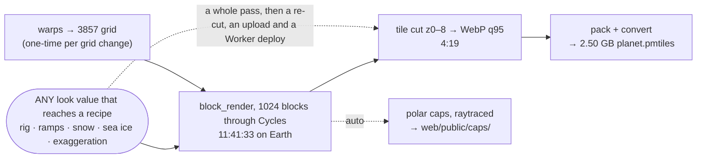

# Terrella: processes and how long they take

- Every number here is measured on the reference machine (RTX 4070 Super, 16 cores, 29 GB RAM, ext4 NVMe), not estimated; where a figure is an estimate it says so.
- Numbers are current-state, qualified by the config that determines them (grid size, thread layout), never by date. When the pipeline changes, re-measure and replace: if a number and reality disagree, the number is the bug.
- This file carries the figure, the guard and the trap, so it stays a lookup rather than an argument. How a figure was derived is not restated here.

## How "re-run" works

- Every stage is guarded by `is_stale(output, *inputs)`: it rebuilds only if its output is missing, never completed (`.done` marker), or older than any input. A re-run costs ~0 s per stage until something upstream changes.
- Tunables with no file of their own (palette colours, the rig's fields) are materialised into `raytrace_params.json` / `tile_params.json` / each cap's sidecar, whose mtime moves only when a value really changes. That is what makes the guard trustworthy against a `git checkout`.
- `build_tiles` carries a `tiles.done` sentinel plus a `tiles_are_fresh` guard and cuts clean each time (no `--resume`, so a truncated tile cannot survive). `tile_params.json` records the cut's own settings, so an encoding change restages the cut and nothing upstream.
- Nothing in the planet chain is lazy: Cycles computes its own light.

## The planet tile pipeline

`python -m pipeline.tile.planet_pass --body earth [--tiles]`, or instrumented: `bash pipeline/profile/run_pass.sh --body earth [--tiles]`

The shape is the cost model: warp the inputs onto the 3857 grid, render every block through Cycles, then cut. Nothing here is per-country. Warps run and cost what they cost; everything downstream of them is one stage:



One program runs on both bodies. A body is seven differing values on `bodies.Body`, and only two of them change what runs at all: `surface_layers`, which is why five of Earth's layer warps have no Mars figure, and `tile_max_zoom`, which sets the grid. **The two columns are measured at different grids, so do not scale one from the other.**

| # | Stage | Earth, 131072² z8 | Mars, 65536² z7 | Re-run (fresh) | Output | Guard |
|---|---|---|---|---|---|---|
| 0 | `fuse/fuse_planet.py`, 648 cells @ 10″, 12 workers | **~15 min** | n/a, one DEM file | skip | `work/planet/chunks/` + 3 VRTs + the seam declaration, 14 GB | per-cell exists() |
| 0a | `fuse_planet.py --masks`, both masks re-fused at 1″ lat × 10″ lon, 6 workers | **27m44s** | not declared | skip | `oceanmask_1x10s` + `watermask_1x10s`, +840 MB | per-cell exists() on its own output |
| 0b | `--build-vrts` alone, re-index the chunks and re-declare | **~20 s** | n/a | replaces nothing: the XML is byte-deterministic | 3 VRTs + `planet_rasters.json` | content compare |
| 1 | warp height → 3857 | **6:49** | **4:37** | ~0 s | `height_3857.tif` 44 GB | `is_stale` |
| 1b | `wrap_seam.close_wrap_seam` | **~0 s** | **0:42** | ~0 s | one column written | inside the warp, ungated |
| 2 | warp ocean + water masks → 3857 | **5:03** (ocean 2:30 + water 2:32) | not declared | ~0 s | 94 MB | `warp_needs_rebuild` |
| 3 | warp GLOBathy lake depth → 3857 | **1:01:44** (nodata-masker-bound) | not declared | ~0 s | `lakedepth_3857.tif` 310 MB | `warp_needs_rebuild` |
| 3b | warp snow + rasterize glaciers + rasterize Antarctic rock + warp sea ice → 3857 | **snow 15:16, glaciers 0:19, rock 0:27, sea-ice 14:42** | **0:00**, declared and skipped rather than absent | ~0 s | four `*_3857.tif` | `warp_needs_rebuild` |
| 3c | ice alpha, polar bands (`mars_ice.build_alpha_raster`) | not declared | **2:23**, and 5:12 on a colder page cache | ~0 s | `ice_alpha_3857.tif` | `warp_needs_rebuild` |
| 4 | `tile/block_render.py`, the raytraced producer: every block through Cycles, one at a time | **11:41:33**, 1024 blocks at 1.46 blk/min, 0 failures. Per block 23.8 s min, 34.5 s median, 76.8 s p95, 194.3 s max | **2:49:57**, 256 blocks, 0 failures | ~0 s, but all or nothing: a moved input or recipe clears every marker and every block re-renders | `planet_rgb.tif` 30 GB | `raytrace_deps` + `raytrace_params.json` |
| 5 | `build_tiles`, `gdal raster tile`, WebP q95 | **4:19**, 87,381 tiles, 3.1 GB | **1:21**, 21,845 tiles, 1.4 GB | skip | `tiles/` | `tiles.done` + `tile_params.json` |
| 6 | `cap_pass`, both discs | **3:11** | **~1:15** *(isolated)* | ~2 s fresh check | `web/public/caps/` | recipe sidecar + source mtimes |
| 7 | pack + convert | **0:16** | **~4 s** | n/a | `planet.pmtiles`, 2.50 GB / 1.40 GB | n/a |
| T | `tile/terrain_rgb.py`, terrain-RGB encode + cut, 8 m, lossless WebP *(separate lane, reads `height_3857.tif` directly)* | **30:14** cold, of which cutting is 8:08 (z8 alone 5:31). z0–6 is ~4 min once the chain exists | **8:15** cold, **6:03** re-cut with the chain on disk | skip | `bathy_s8_webp/tiles/` 2.72 GB / 0.77 GB | `tiles.done` + `terrain_params.json` |
| R | `tile/relief_scan.py`, the block partition's per-cell cache *(separate lane, feeds `block_plan`)* | **3:07**, 1.5 GB peak | **0:41** | ~0 s | `relief_cells.tif` | `is_stale` + `relief_params.json` |

No single run produced every column: the cut and memory figures come from one instrumented pass, the seam and whole-pass figures from the seam rebuild, and Mars's warp is carried from a cold z7 pass whose log was overwritten, making it the one number that cannot be re-derived without a rebuild.

Row 6 is the one place the two columns are two programs rather than one at two scales: Earth's is the stage at a pass tail, Mars's a standalone rig. Reached through a pass a cap costs about twice its standalone time, and the standalone figure is in § What a look change costs.

Context does not drive block time on either body. On Mars the ice does, at ~95 s/block against ~42 s; on Earth the slowest block sits on a mid-range context. Do not price a pass from one median block.

Traps, each one earned:

- `gdal raster tile` needs `--tile-size 512` explicitly, since the default 256 halves the master.
- Never tile a many-source VRT: materialise a tiled GTiff with overviews first.
- BigTIFF is mandatory past z6, and both `terrain_rgb.py` sinks pass `bigtiff: "IF_SAFER"`. A classic TIFF caps at 4 GB and cannot surface the failure below z7.
- The elevation chain keys on `.done` markers rather than `exists()`: rasterio creates its target at write-start, and a truncated float32 raster reads as a very flat planet rather than as an error.

Four things about the pass that no row can carry:

- **The seam rebuild is the shape a fix to the master costs**: on Mars, **9:10** wall, 34:29 CPU, 14.9 G peak, everything from `close_wrap_seam` down with the warp and ice alpha fresh.
- **Earth pays nothing for row 1b** because its warp declares no nodata, so the function returns before the scan. That is what lets the call sit outside the warp's freshness gate, where it has to be to reach a master already on disk.
- **The caps print fresh and skipped on a master rebuild, which is correct**: `cap_sources` reads the VRTs and the ice sources, never `height_3857.tif`.
- **`mars_ice._warp_band` is a single `gdalwarp` and must not grow sub-banding.** Snow and sea ice band because a whole-grid warp's pole-inflated average scale makes GDAL read the source decimated; Mars's ice occupies a few degrees, and a direct warp measured identical to the sub-banded reference at 0.0000 DN against a 4×-decimated control at 61.11 DN. Re-measure if Mars's `tile_max_zoom` or `look/viking_luma`'s grid moves.

### Memory: what a cap has to back, and which of the three readings says so

This block is the authority for both cgroup caps, and `pipeline/profile/pass_memory.py` argues from its figures by name. A heading rather than a bold lead-in because code cites it.

Three readings, and only one answers "did it fit". The cgroup's `memory.peak` is charged for reclaimable page cache, so it overstates. Summed per-process `VmHWM` overstates worse: it adds lifetime high-water marks across children that never coexisted, and a Mars pass sums to 19.03 GiB under a 16 G cap that never fired. Size a cap off peak instantaneous summed RSS.

| Stage | Peak | Body |
|---|---|---|
| `cap_pass` | **14.41 GiB** | Earth. Sizes `CAP_RENDERING_GIB` |
| ice alpha | **5.91 GiB** | Mars, its heaviest non-cap stage. Sizes `STANDING_GIB` |
| largest hero's base grid | **17.0 GB** host | Australia at 67M micropolygons, which fails outright. Sizes `HEAVY_JOB_GIB` |
| raytraced block producer | **8.18 GiB** | Blender is 8.04 of it. Nothing accumulates across blocks |
| tile cut z0–8 | **3.74 GiB** | the lightest of the three stages, not the reason for the cap |

- Do not bound a stage with a cgroup peak taken on one cold block: it reads lower than the live RSS it is taken to bound. A cold single-block probe is charged almost no page cache, so the inflation meant to leave it conservative never happens.
- `memory.current` is not RSS. During tiling the cgroup sits at ~16 GiB, but that is reclaimable page cache (`anon` 0.58 GiB). Watch anon, not the total.
- Which stage binds depends on the body's producer and its caps' freshness, and `pass_memory.py`'s field sees neither. On a raytraced Earth pass whose caps are current, neither the composite nor `cap_render` runs, so both peaks justifying 16 G are unbacked and the preflight can refuse a pass the machine could have run. 16 G stays correct as a worst-case bound; it is not the binding one in that state.
- An idle machine means the browser too. A Tier-3 globe left open costs the block producer 1.37x, measured by comparing the same block across two passes, which is the only oracle that works: per-block cost ranges 29 s to 158 s by context alone.
- `run_pass.sh` reads `MemAvailable` and refuses to start below the cap, because a cap the machine cannot back relocates the OOM to the most expensive moment. Override with `ALLOW_LOW_MEMORY=1`; point `MEMINFO` elsewhere to test the guard. The reference machine runs close to the line, ~16.7 GiB available against the 16 G cap with a browser and editor open.
- `MEMORY_CAP_OVERRIDE_GIB` substitutes the number afterwards and prints that it did. It is read after the resolver, so `--body` stays enforced; a non-numeric value aborts, since bash would evaluate it as 0 and clear every cap.

### What a look change costs

Any look value that reaches a recipe restages the whole planet through Cycles, and the caps restage behind it. All warps skip, including the 1:01:44 lake warp. There is one tier, so there is no cheaper path to leak into and nothing to watch the log for. Batch look changes rather than landing them one at a time.

| Scenario | Wall | Notes |
|---|---|---|
| Any look re-tune that reaches a recipe | **11:41:33 + 4:19** on Earth | then a re-cut, an upload and a Worker deploy |
| Everything cold, shade only | **~41 min** (+ the cut → ~46) | excludes the one-time lake warp + fuse |
| `--tiles`, everything fresh | **~0.4 s** | the cut runs only when `planet_rgb` changed |
| No `--tiles`, everything fresh | **0.29 s** | every stage skips; the guard working |
| Lake-depth warp (stage 3) | **1:01:44** | one-time; its `.done` stops a pass paying that hour again |
| Cast shadows (`shadow_strength` > 0, currently 0.0, rejected) | **+0.625 s/Mpx** | Iran A/B at 32.4 Mpx: 16.73 s → 37.01 s, +121%, peak RSS unchanged. Linear in `shadow_reach` |
| Polar cap render (`tile/cap_pass.py`, raytraced) | **45:35** standalone, north 22:44 and south 22:50, 56 Cycles frames | 28 frames a pole at ~44.7 s, a 57 s blend each, and ~1:42 / 1:27 of prep. Price the stages either side, not the frames alone. Peak memory is not measured. Through a pass the same stage costs about twice its standalone time |

A cap is priced per pole per body, and 45:35 is neither. Mars's south is **22:12**: 68.7 s prep, 28 frames in 19.9 min, a 58.1 s blend, 12.6 s of rungs.

A cap can be previewed at reduced resolution. `CapGrid.px` is a field and `frame_plan` derives from longitudes, so a disc renders at any side: Mars at 1024 px is **28 frames at 1.6 s each, 54 s end to end**. It needs an isolated store and that is not optional, since `frames_dir` and `cap_render_dir` key on the pole alone while `px` rides in `cap_raytrace.params`: redirect `MAPS_DATA` and run from an arm worktree. The harness and its refuse-to-render guard live in a scratch root carrying a KEEP.md.

Drop `--tiles` while iterating and take frames off `planet_rgb.tif` directly. Nothing about the colour is decided by the tiler, so `gdal_translate -srcwin` shows the ratified pixels with no browser resampling, projection or atmosphere, off the same raster the tiles are cut from. Run `--tiles` once, at the end, on the variant that won.

Three commands, not one: the archive is a separate chain from the pass. Nothing in the pass touches `planet.pmtiles`, so a look change is invisible in the browser until all three have run:

```
pipeline/profile/run_pass.sh --body mars --tiles
python -m pipeline.tile.pack_pmtiles --body mars --layer relief   # → planet.mbtiles, the bridge
tools/pmtiles convert …/planet.mbtiles …/planet.pmtiles   # → what the dev server reads
```

`tools/` is gitignored, so `tools/pmtiles` is a download: take the build for your platform from [go-pmtiles releases](https://github.com/protomaps/go-pmtiles/releases). The dev server serves tiles `no-cache`, so a plain reload picks up a re-pack, and the committed tile token does not need regenerating to iterate, being a CDN cache key and a deploy concern only.

## Hero renders: Earth only, and a separate pipeline from the tiler

The hero lane is per-country and `config/countries.toml` is Earth's, so Mars has no heroes and no row here.

| Stage | First run | Re-run | Output |
|---|---|---|---|
| `render/render_prep.py --frame` → `frame.json` | ~seconds | `is_stale` | per-country frame + warps |
| `render/lake_mask.py` (stage 6 of 7) | **0:11** finland (lake-densest) / **0:03** estonia | skip-if-exists | `lakedepth.tif` |
| `render/scene_build.py --render`, headless Cycles, OptiX | **3:36 @ 8K** (finland 1:29 at 4142×7680) | n/a | one hero PNG |
| Full batch, 203 heroes | **~10.5 h** (0 fail; 9.36 h GPU-bound = 89.5% duty) | per-country resume | `blender/renders/` |
| `look/sky_view.py` re-shade | **no GPU, minutes**, re-running the AO over kept `heroes/raw/*.png` | n/a | shaded `heroes/*.png` |
| Targeted re-render (7 microstates) | **~28 min** (~4 min each) | per-country resume | the named heroes |
| `batch --through prep`, warm walk | **1.25 s/country** (six guarded stages) | same | prep-complete markers |

- 8K frames denoise on CPU, not GPU: GPU render + GPU OIDN contend for the 12 GB VRAM → Xid 31 MMU fault.
- The wall is host RAM as well as VRAM. A render block near 21M micropolygons is comfortable, Nepal at 41.8M renders but takes 177% longer, and Australia at 67M fails with `Failed to build OptiX acceleration structure` having wanted **17.0 GB** of host. Which frame sizes sit on which side is unmeasured: Nepal clears at 36.8 Mpx and Australia does not at 58.8.
- The warm walk is near-free because both expensive per-country redundancies are guarded: `build_mosaics.sh` skips on a matching `.sources` sidecar (17.6 → 0.63 s) and `download_glo30` runs one ETag preflight per day. What remains is the deliberate subprocess-import tax, six isolated GDAL/rasterio starts for OOM isolation.

## Acquire (one-time, network-bound)

Run once; all are resumable and verify against a pinned size/md5, so a re-run is a no-op. **`ATTRIBUTIONS.md` is the roster** of every dataset for both bodies, and `pipeline/acquire/` is the runnable list. Only the sources whose size or acquisition carries a cost are below.

| Source | Size | Notes |
|---|---|---|
| Copernicus GLO-30 | **551 GB** | per-country, on demand: never bootstrapped globally (Russia alone ≈ 4,900 tiles) |
| ESA WorldCover | 114 GB | hero snow only, not the tile pipeline |
| GLOBathy | 16.7 GB zip | → 83,357 per-lake rasters; reclaimable once extracted |
| GEBCO 2026 | 7.3 GB | bathymetry + ice surface |
| RGI 7.0 glaciers | 2.7 GB | all 19 regions, merged to a 1.1 GB gpkg. Never pass `-skipfailures`: it sets the transaction size to 1, which is quadratic into a populated table (51.8 s against 1.3 s for one region) |
| NSIDC-0791 snow persistence | 1.6 GB | tile snow |
| OSI SAF sea ice (OSI-450-a) | 640 MB | anonymous THREDDS, **serial** (OSI SAF forbids parallel); 720 monthly files |
| Cop30 void-fill | 1.2 GB | fusion void-fill |
| MOLA/HRSC blended DEM | **11.4 GB** | the whole of Mars's elevation input, one uncompressed file (11,384,463,908 B, 106694 × 53347 Int16), size-checked against `Content-Length` |
| Natural Earth | 38 MB | borders, framing, coastline oracle |

## Frontend and serving

| Process | Command | Time | Notes |
|---|---|---|---|
| Astro dev server, the product globe | `pnpm dev` in `web` | **~2 s** | `/earth` on port 4321. Serves three store routes; `/tiles` answers three archives in-process, addressed `{body}/{layer}/{token}/{z}/{x}/{y}.{ext}`, through the same resolver the Worker uses. The local twin of the production tile Worker |
| Static build | `pnpm build` | **~seconds** (206 pages) | emits HTML/CSS/JS only, assets stay external |
| Tile smoke test, not the product | `python3 -m http.server` in `work/planet_tiles` | instant | proves the pyramid renders with zero deps |
| Worker deploy + first TLS | `npx wrangler deploy` in `web/worker` | deploy seconds; certificate a few minutes | Certs are automatic at any depth, so depth changes when TLS works, not whether. Expect `TLS alert handshake failure` while it issues: check the certificate, never `dig`, since a wildcard answers at any depth |
| Site deploy | `pnpm run deploy` in `web` | preflight ~2 s · build ~0.5 s · upload **13 s** | Never `wrangler deploy` alone: that ships a same-origin build whose 204 hero pages 404. The tile Worker deploys first, always: the pair is safe in exactly one order, because a new Worker serves an old site and an old Worker serves nothing a new site asks for. Skipping it 404s every tile. Verify against the live host, never the repo |
| Deploy preflight | `pnpm run check:deploy-sync` | **~2 s** (1,624 objects) | Advertised-but-absent is fatal; present-but-unreferenced warns. Needs `R2_ENDPOINT` and the `r2` profile |
| R2 upload, the archives | `aws --profile r2 --endpoint-url <r2> s3 cp <archive> s3://terrella-tiles/<key>` | **~2 min** per 3 GB at ~205 Mbps. Detach it | A new key per cut, never an overwrite: a warm Worker isolate holds directory byte offsets, and offsets from one cut against another's bytes serve a corrupt tile with a 200. Verify by reconstructing the ETag, and the file's size picks the oracle (plain MD5 at or below the 8 MiB threshold, else the MD5 of concatenated part MD5s plus `-N`) |
| R2 upload, heroes + overlays | `aws … s3 sync … --exclude "*.aux.xml" --exclude "*_recipe.json"` | **~2 min** (1,622 files, 2.13 GB) | Both excludes are mandatory: GDAL PAM sidecars are the bulk, and the recipe is internal freshness state that must not be published. GeoJSON needs `--content-type application/json` or the edge will not compress it |
| Hero variants, the srcset ladder | `hero_variants.py --jobs 8` | **6 min** (203 × 6 rungs); ~49 min at `--jobs 1` | One `gdal_translate` peaks at 523 MB, so the ceiling is cores. Quality is a policy (`quality_for`): q85 to 1920, q95 at 3840/native |
| Spotlight overlays | `gen_spotlight.py --only <slugs> --jobs 6` | **1m45s** (203 slugs × 3 small rungs) | The "~8 GB per job" in its docstring is a native-rung figure. Small rungs measure 0.49 GB per job, ~16× lighter, so a high `--jobs` is safe there and reckless for a full pass. Time one slug before choosing |
| Country vector tiles | `compose/countries_pmtiles.py` | **17 s** (258 features → 10.2 MB, z0–8) | GDAL 3.12 writes PMTiles directly: no tippecanoe, no `pmtiles convert`. The staged GeoPackage exists only because the driver cannot append a layer to an archive it already wrote |
| PMTiles packaging | `pack_pmtiles.py` → `pmtiles convert` | dir→MBTiles **3 to 10 s** (87,381 tiles); convert **4.9 to 7.2 s** → 2.50 GB | Always run convert capped and with `--tmpdir` on ext4: uncapped it stages ~12 GB through tmpfs `/tmp`, which is RAM. Tile count and cut time do not follow master size, the grid being 131072² either way |
| PMTiles packaging, terrain | `pack_pmtiles.py --layer terrain` | dir→MBTiles **12 s**; convert **6.1 s** → 2.63 GB | Dedupe is 1.4% against relief's ~5%: elevation tiles repeat only where the sea is flat. Index 196,747 B, under `INDEX_PREFETCH_BYTES` (262,144), which the Worker's test asserts |
| PMTiles packaging, terrain on Mars | same with `--body mars` | dir→MBTiles **1 s** (21,845 tiles); convert **1.5 s** → 0.806 GB | Dedupe is exactly zero, a planet with no sea having no identical bodies. Index 51,473 B. The flip-sensitive pair to byte-compare is `z7/64/0` against `z7/64/127` |

## If you only remember one thing

The pipeline is fast to re-run and slow to build: a cold shade is ~46 min with the cut, plus a one-time hour for the lake warp; warm is seconds. Even the tile cut is guarded, so a fully-fresh `--tiles` re-run is seconds too.
