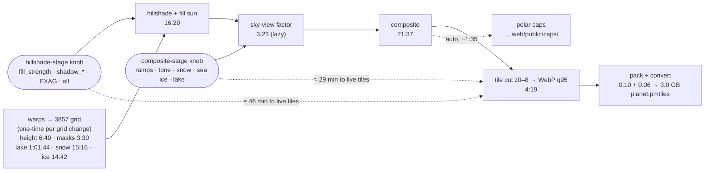

# Terrella — processes and how long they take

- Every number here is **measured on this box** (RTX 4070 Super, 16 cores, 29 GB RAM, ext4 NVMe),
  not estimated; where a figure is an estimate it says so.
- Numbers are **current-state**, qualified by the config that determines them (grid size, thread
  layout) — never by date. When the pipeline changes, re-measure and replace; **if a number and
  reality disagree, the number is the bug.** How each number moved over time lives in HISTORY
  (§ PROCESS.md goes dateless holds the superseded values).

## How "re-run" works

- Every pipeline stage is guarded by `is_stale(output, *inputs)`: it rebuilds only if its output
  is missing, never completed (`.done` marker), or older than any input. A re-run costs
  **~0 s per stage** until something upstream actually changes.
- Tunables that never reach a file of their own (`KNOBS`, palette colours) are materialised into
  `composite_params.json` / `hs_params.json` / `tile_params.json`, whose mtime moves **only when a
  value really changes** — that is what makes the guard trustworthy against a `git checkout`.
- One stage is the exception, and it is the interesting one: **`global_occlusion` (sky-view) has
  no file to stamp**, so it is guarded by *laziness* — passed to the composite unevaluated, it
  runs only if the composite is stale.
- `build_tiles` carries a `tiles.done` sentinel + a `tiles_are_fresh` guard, and **cuts clean
  each time** (no `--resume`, so a truncated tile can't survive). → HISTORY § pipeline hardening
- **`tile_params.json` is part of that guard**: the cut's own settings (format, quality, tile size,
  zooms, resampling) are recorded beside the pyramid, so changing the encoding restages the cut and
  nothing upstream. Without it a format change left the pyramid reading as fresh.
  → HISTORY § the ladder ships against measured layout

## The planet tile pipeline

`python -m pipeline.tile.shade_planet [--tiles]` — or instrumented:
`bash pipeline/profile/run_pass.sh [--tiles]`

The whole cost model in one picture — where a look change enters is what it costs:

The hero pipeline is the other lane (separate table below): per-country prep walk **1.25 s warm**
(six guarded stages) → Blender render **1:29–3:36** → full ~204-country sweep **~10.5 h**, GPU-bound.

All stage numbers below are at the **131072² grid** (the full Mercator square) with the composite
**threaded 128-row/4-worker**:

| # | Stage | First run | Re-run (fresh) | Output | Guard |
|---|---|---|---|---|---|
| 0 | `fuse/fuse_planet.py` — 648 cells @ 10″, 12 workers *(separate command; run `build_mosaics.sh` first after any tile download — a stale mosaic fuses new land as ocean)* | **~15 min** (43 s/dense cell; the 108 polar cells ~2 min total — GLO-30 thins toward the pole) | skip | `work/planet/chunks/` (648 cells) + 3 VRTs, 14 GB | per-cell exists() |
| 1 | warp height → 3857 | **6:49** | ~0 s | `height_3857.tif` 44 GB | `is_stale` |
| 2 | warp ocean + water masks → 3857 | **~3:30** (1:45 + 1:47) | ~0 s | 69 MB | `warp_needs_rebuild` |
| 3 | warp GLOBathy lake depth → 3857 | **1:01:44** (nodata-masker-bound, 102% CPU; no lakes south of −60°, the cost lives in the 50–70°N belt) | ~0 s | `lakedepth_3857.tif` 310 MB | `warp_needs_rebuild` |
| 3b | warp snow persistence (banded) + rasterize glaciers + warp sea ice (banded) → 3857 | **snow 15:16, glaciers 0:19, sea-ice 14:42** | ~0 s | `snow_persistence_3857.tif`, `glacier_3857.tif`, `seaice_3857.tif` | `warp_needs_rebuild` |
| 4 | `render/hillshade.py` — per-row z-factor **+ fill sun** | **16:20** | ~0 s | `hs_3857.tif` | `is_stale` |
| 5 | `global_occlusion` — sky-view factor | **3:23** (I/O-bound) | ~0 s | in-memory only | **lazy** |
| 6 | `composite_planet` — ramps × hillshade × SVF + snow + sea ice + lake depth | **21:37** (1024 windows; the Antarctic windows are all snow+ice work) | ~0 s | `planet_rgb.tif` 11 GB | `is_stale` |
| 7 | `build_tiles` — `gdal raster tile` z0–8, WebP q95 | **4:19** | **skip** | `tiles/` **3.1 GB**, 87,381 tiles | `tiles.done` + `tile_params.json` |
| T | `tile/terrain_rgb.py` — terrain-RGB encode + cut **z0–8**, 8 m, lossless WebP *(separate lane: reads `height_3857.tif` directly, never the composite, and is not part of the shade pass)* | **41:00** for the shipping z0–8 pyramid, including building `elev_z7`. A z0–6 variant is **~4 min** once the chain exists. | **skip** | `work/planet_terrain/bathy_s8_webp/tiles/` **2.63 GB**, 87,381 tiles | `tiles.done` + `terrain_params.json`; chain on `elev_z*.done` |

Why the numbers are what they are (current-state explanations, not history):

- **The composite is DRAM-bandwidth-bound, not I/O-bound**: full-width windows make every
  3-channel array ~402 MB against ~32 MB of L3, so every numpy op is a DRAM round-trip — which is
  why threading caps at ~3.5× and bigger windows do not help. → HISTORY § the composite is threaded
- **The 128-row window is for the memory cap, not speed**: it fits 4 workers under `MemoryMax=12G`
  (256-row/3-worker OOMs). The threaded layout shifts the look sub-perceptibly (worst 20 DN on
  mountain snow, invisible at true scale).
- **The fill sun doubles the hillshade arithmetic** (a second `hillshade_array` per window, same
  blocks, no extra I/O). → HISTORY § the tiles were missing the hero's fill sun
- **A grid change restages every warp**: `warp_needs_rebuild` = mtime **or** off-grid, so the
  warps re-run only when the grid grows (next trigger: a z10 extension). The Antarctica grid
  change measured **2:28:01** end-to-end, dominated by the 1:01:44 lake warp.
- **Stage T's ~4 min is three independent measurements, not one.** The first run built the shared
  elevation chain and the `clamp` variant in **7:55**, then `bathy` in **3:53** reusing it — so the
  chain is ~**4:02** and a variant is ~**4 min**. Three later re-cuts at 2/4/8 m, chain present,
  came in at **3:49 / 3:57 / 4:16**. It is a single streaming descent from the 44 GB master, so it
  is I/O-shaped, not DRAM-bound like the composite.
- **Lossless WebP cuts ~3.8× FASTER than PNG, as well as 0.67× the size.** Same variant, same 8 m
  step, z6 cut alone: **PNG 1:49 vs WebP 0:29** (z5 0:42 → 0:12, z4 0:35 → 0:10). PNG's adaptive
  per-scanline filtering plus zlib 9 is simply more work than the WebP lossless coder. The whole
  z0–6 cut at the shipping settings is **~0:57**. → HISTORY § the terrain archive gets a third smaller
- **Stage T is guarded like every other stage.** `tiles/` is cut into `tiles_new`, swapped only on
  success, stamped `tiles.done`, and keyed on the master's marker plus `terrain_params.json` — so a
  `--step`, `--format` or `--max-zoom` change restages and nothing else does. One generation of
  rollback stays at `tiles_old`. The elevation chain moved off `exists()` onto its own `.done`
  markers, which is what stops a half-written level being trusted: rasterio creates its target at
  write-start, so the BigTIFF crash below left a full-sized truncated `elev_z8.tif` that an
  existence test accepts, and a truncated float32 raster reads as a very flat planet rather than as
  an error. → HISTORY § stage T gets the guard every other stage already had
- **z7/z8 MEASURED 2026-07-28, and both projections here were wrong in the same direction.** The
  full z0–8 build is **41:00** and **2.63 GB**, against projections of 1.5–2.5 h and ~3.3 GB — so
  ~3× over on time and 25% over on size. Per-zoom cut: **z8 5:29, z7 1:37, z6 0:27, z5 0:12,
  z4 0:10, z3 0:05**, the rest sub-second.
- **CORRECTION — z8 *did* write an elevation intermediate, and it was 47 GB of nothing.** This file
  and HISTORY both claimed `--max-zoom 8` "encodes `height_3857.tif` in place"; it did not. The
  factor-1 branch still called `downsample_elevation`, so the build materialised `elev_z8.tif` —
  a byte-for-value copy of the 46 GB master, proven identical over six windows at exactly 0.0000 m
  with shifted-window controls differing by 240–1660 m. Part of the 41:00 was spent making it.
  `elevation_source` now returns the master itself at its native zoom, so **the claim is true going
  forward and was false when written**. → HISTORY § stage T gets the guard every other stage already had
- **BigTIFF is mandatory past z6 and was missing until 2026-07-28.** The first z0–8 attempt died in
  83 s on `TIFFAppendToStrip:Maximum TIFF file size exceeded` — `GTIFF_CREATE` sets no BigTIFF and a
  classic TIFF caps at 4 GB. It could not surface below z7, and **z6 was surviving on deflate alone**
  (32768² float32 = 4.29 GB raw, 3.4 GB on disk). Both `terrain_rgb.py` sinks now pass
  `bigtiff: "IF_SAFER"`. → HISTORY § tileSize 128 and a z0-8 pyramid ship together

**End-to-end, measured:**

| Scenario | Wall | Notes |
|---|---|---|
| **A hillshade-stage re-tune** (`fill_strength` → live tiles) | **~46 min** | hillshade 16:20 + SVF 3:23 + composite 21:37 + tile cut 4:19. Warps all skip. |
| **A composite-stage re-tune** (`snow_curve`, `ICE_LO`, ramp colours → live tiles) | **~29 min** | SVF 3:23 + composite 21:37 + tile cut 4:19. |
| Everything cold, shade only | **~41 min** (+ the cut → ~46) | excludes the one-time lake warp + fuse |
| `--tiles`, everything fresh | **~0.4 s** | the cut is guarded; it runs only when `planet_rgb` actually changed |
| No `--tiles`, everything fresh | **0.29 s** | every stage skips; this is the guard working |
| Lake-depth warp (stage 3) | **1:01:44** | one-time; its `.done` is what stops a pass paying that hour again |
| **Cast shadows** (`shadow_strength` > 0 — currently 0.0, rejected) | **+0.625 s/Mpx** measured; est. **+2.1 h** on the planet hillshade at `shadow_reach=300` | Iran region A/B (32.4 Mpx): 16.73 s control → 37.01 s, **+121%**, peak RSS unchanged (the wide halo costs time, not memory). The march is `reach_px` full-raster passes — cost is **linear in `shadow_reach`** (300 px ≈ 2.6 h, covers 6,115 m of relief). Hillshade-stage, so ~46 min + the shadow march to see it. → HISTORY § cast shadows REJECTED A SECOND TIME |
| **Polar cap render** (`tile/cap_render.py`) | **~1:36** both caps at the production 8192² (54 + 42 s), peak **14.3 GB north / 13.9 GB south** (measured under `systemd-run`, anon RSS) | AEQD warps + the shared `shade.composite` + baked coastline → `web/public/caps/cap_{north,south}_{1024,2048,4096,8192}.webp` (both caps together: **155 KB · 559 KB · 1.7 MB · 5.1 MB**, WebP q85) + `caps.json`. Every rung is downsampled from the one render, so the whole rung set costs ~1 s, not a second pass — adding the 1024/2048 rungs did not move this row's runtime (re-measured 1:39). The web layer picks one by the cap's projected on-screen size, so a default visit fetches only the 1024s. The fast browser-free pole-look loop. **Freshness-guarded** (recipe sidecar on `composite_params` + source mtimes + the WebP quality + the rung list; `shade_planet`'s pass tail invokes it, so the caps restage whenever the look does — a fresh check is ~2 s). → HISTORY § polar caps PRODUCTIONIZED · § the cap rung |

> ⚠ **The cap render does NOT fit under the old 12 G cap** — it OOM-killed twice at a 12.5 GB
> anon-RSS peak before being measured at ~14 GB (this row previously claimed ~4 GiB, which was
> never true at 8192²). It needs **≥16 G**, and that reaches beyond a manual run: `shade_planet.py`
> invokes `cap_render` as a subprocess at the tail of the shade pass, inheriting the pass's cgroup —
> so a pass at `MEMORY_CAP=12G` completed every tile stage and then died at the last one.
> **Resolved:** `run_pass.sh`'s shade cap is now **16 G**, matching the tiling run. The composite is
> unaffected — it peaks at 10.55 GiB and `COMPOSITE_ROWS=128` is a hardcoded constant, not a
> function of the cap, so a bigger cap cannot let it grow. Accepted cost: 12 G was also an
> accidental tripwire on composite footprint, and a regression there now hides until 16 G.

**Memory preflight (both run labels).** `run_pass.sh` reads `MemAvailable` and **refuses to start**
when it is below the cap, because a cap the box cannot back protects nothing — it relocates the OOM
to the most expensive moment, hours in, after every finished stage has been paid for. `MemAvailable`
is the kernel's estimate of what a new job can take without swapping, which is the actual question
(`free`'s "free" column undercounts by ignoring reclaimable page cache). Override deliberately with
`ALLOW_LOW_MEMORY=1`; point `MEMINFO` elsewhere to test the guard. **This box runs close to the
line** — ~16.7 GiB available against the 16 G cap with a browser and editor open, so expect the
preflight to be a real gate, not a formality.

**What a knob actually restages** (measured, not inferred): all warps skip, including the 1:01:44
lake warp. A **hillshade-stage** knob (tracked in `hs_params.json`) restages hillshade → SVF →
composite → tiles — **~46 min**. A **composite-stage** knob (tracked in `composite_params.json`)
restages SVF + composite → tiles — **~29 min**. The composite is the bulk of any art iteration
(§ the composite is threaded is the 3.5× that made iterating viable), and the caps auto-restage
(~1:35) behind either knob.

Peak RSS is **10.55 GiB** — the threaded composite under `MemoryMax=12G` (~1.14× headroom; a 6-worker
layout would OOM). Tiling runs under a **separate 16 G cap** (`run_pass.sh`, sized off the per-worker
`GDAL_CACHEMAX` math) and peaks ~2 GiB anon across 18 processes. **`memory.current` is not RSS**:
during tiling the cgroup sits at ~16 GiB, but that is reclaimable page cache (`anon` 0.58 GiB) —
watch **anon**, not the total.

## Hero renders (separate pipeline — Blender, not the tiler)

| Stage | First run | Re-run | Output |
|---|---|---|---|
| `render/render_prep.py --frame` → `frame.json` | ~seconds | `is_stale` | per-country frame + warps |
| `render/lake_mask.py` (stage 6 of 7) | **0:11 finland (lake-densest) / 0:03 estonia** — the feared 83k-source-VRT warp cost is seconds, not minutes | skip-if-exists | `lakedepth_aea.tif` (log1p ramp position) |
| `render/scene_build.py --render` — headless Cycles, OptiX | **3:36 @ 8K** (finland 1:29 at 4142×7680) | n/a | one hero PNG |
| Full batch — **~204 heroes** | **~10.5 h measured** (a full sweep at the current scene rig: 203 heroes, 0 fail; 9.36 h GPU-bound = 89.5% duty; host RSS peaked ~10 GB vs the 25 GB cap → the single 12 GB GPU is the wall, more RAM saves nothing) | per-country resume | `blender/renders/` |
| `render/sky_view.py` re-shade (look re-tune, no re-render) | **no GPU, minutes** — re-runs the AO over the kept `heroes/raw/*.png`; a `sky_view_strength` change re-shaded all 203 with no Blender pass | — | shaded `heroes/*.png` |
| Targeted re-render (e.g. a sea-floor fix across 7 microstates) | **~28 min** (~4 min each, tiny frames) — rm `heightfield_aea.tif` + hero + raw, then `batch --through render --only` | per-country resume | the named heroes |
| `batch --through prep`, warm walk | **1.25 s/country** (six guarded stages) | same | prep-complete markers |

- 8K frames denoise on **CPU**, not GPU: GPU render + GPU OIDN contend for the 12 GB VRAM → Xid 31
  MMU fault.
- The warm walk is near-free because the two expensive per-country redundancies are guarded:
  `build_mosaics.sh` skips when its `.sources` sidecar matches (17.6 → 0.63 s) and
  `download_glo30` runs one ETag preflight per day (`preflight_ok.json`, then ~0.07 s). What
  remains is the deliberate subprocess-import tax (six isolated GDAL/rasterio starts — OOM
  isolation). → HISTORY § the prep-walk redundancy cut

## Acquire (one-time, network-bound)

Run once; all are resumable and verify against a pinned size/md5, so a re-run is a no-op.

| Source | Size | Notes |
|---|---|---|
| Copernicus GLO-30 | **551 GB** | per-country, on demand — never bootstrapped globally (Russia alone ≈ 4,900 tiles) |
| ESA WorldCover | 114 GB | **hero snow only**, not the tile pipeline |
| GLOBathy | 16.7 GB zip | → 83,357 per-lake rasters; **reclaimable once extracted** |
| GEBCO 2026 | 7.3 GB | bathymetry + ice surface |
| RGI 7.0 glaciers | 2.6 GB | tile snow |
| NSIDC-0791 snow persistence | 1.6 GB | tile snow |
| OSI SAF sea ice (OSI-450-a) | 640 MB | tile sea ice; **anonymous** THREDDS, **serial** (OSI SAF forbids parallel); 720 monthly files → the 1991–2020 frequency climatology |
| Cop30 void-fill | 1.2 GB | fusion void-fill |
| Natural Earth | 38 MB | borders, framing, coastline oracle |

## Frontend and serving

| Process | Command | Time | Notes |
|---|---|---|---|
| Astro dev server — **the product globe** | `pnpm dev` in `web` | ~2 s | `/globe` on Astro's default port 4321 (not pinned in config); serves the three store routes (`/heroes`, `/borders`, `/tiles`) from `web/.env` paths, dev-only middleware, `no-cache`. `/tiles/{z}/{x}/{y}.webp` is ranged out of `planet.pmtiles` in-process — the local twin of the production tile Worker |
| Static build | `pnpm build` | ~seconds (206 pages) | emits HTML/CSS/JS only — assets stay external |
| Tile smoke test — **not the product** | `python3 -m http.server` in `work/planet_tiles` | instant | proves the pyramid renders with zero deps; no starfield/borders/atmosphere by design |
| Worker deploy + first TLS | `npx wrangler deploy` in `web/worker` | deploy seconds; **certificate a few minutes** | Universal SSL covers only the apex + first level, but Workers Custom Domains **auto-generate an Advanced Certificate** for the target hostname and R2/Pages custom domains use Cloudflare-for-SaaS certs — both automatic, no ACM, any depth. So depth changes *when* TLS works, not *whether*. Expect `TLS alert handshake failure` while the cert issues, even though DNS already resolves: `*.zone` is an RFC 4592 wildcard that answers at any depth, so **check the certificate, never `dig`** |
| Site deploy | `pnpm run deploy` in `web` | preflight ~2 s · build ~0.5 s · upload **13 s** | Runs the asset-sync preflight, then builds with the production bases, then uploads. **Never `wrangler deploy` alone** — that ships a same-origin build whose 204 hero pages 404. Re-deploys upload nothing when `dist/` is unchanged ("No updated asset files") |
| Deploy preflight | `pnpm run check:deploy-sync` | ~2 s (1,624 objects) | Lists `terrella-assets` and diffs it against the manifest. Advertised-but-absent is fatal (the site would 404); present-but-unreferenced warns, since the usual cause is a manifest not regenerated after a render. Needs `R2_ENDPOINT` in `web/.env` and the `r2` profile; `SKIP_ASSET_SYNC_CHECK=1` overrides |
| R2 upload — the archive | `aws --profile r2 --endpoint-url <r2> s3 cp planet.pmtiles s3://terrella-tiles/` | **~2 min** for the 3.0 GB WebP archive; **10m28s** measured on the 16.06 GB PNG one (≈ 205 Mbps on a 249 Mbps uplink) | 1,916 × 8 MiB multipart parts. Detach it. Verify by reconstructing the multipart ETag locally (MD5 of the concatenated part MD5s + `-N`) — the ETag is NOT a plain MD5, so a naive comparison always "fails" |
| Hero variants — the srcset ladder | `hero_variants.py --jobs 8` | **6 min** (203 heroes × 6 rungs); **~49 min at the default `--jobs 1`** | One `gdal_translate` peaks at **523 MB**, so the ceiling is cores, not the memory cap — but the default stays 1, as `gen_spotlight`'s does. Quality is a policy (`quality_for`): q85 to 1920, q95 at 3840/native. `hero_variants_recipe.json` records what each rung was written at, so a quality change restages exactly that rung and nothing else |
| Spotlight overlays — small rungs only | `gen_spotlight.py --only <slugs> --jobs 6` | **1m45s** (203 slugs × 3 new rungs) | **The "~8 GB per job" in its docstring is a NATIVE-rung figure.** Generating only 640/960/1280 measured **0.49 GB per job**, ~16× lighter, so a high `--jobs` is safe for a small-rung pass and reckless for a full one. Time one slug before choosing |
| Border layers — all rungs | `gen_borders.py` | **7m21s** (201 countries × 5 rungs, serial; no `--jobs` flag) | Redraws the full-res cairo layer per country and writes every rung from that one surface, so adding a rung costs a full regeneration. ~3 s per country |
| R2 upload — heroes + borders | `aws … s3 sync … --exclude "*.aux.xml" --exclude "*_recipe.json"` | ~2 min (1,622 files, 2.13 GB) | **Both excludes are mandatory** — GDAL PAM sidecars are the bulk of them, and `hero_variants_recipe.json` is pipeline-internal freshness state that must not be published (the deploy preflight caught it as an unreferenced object). 609 of the variants store's 2,231 files are GDAL sidecars. GeoJSON needs `--content-type application/json` or the edge will not compress it |
| PMTiles packaging | `pack_pmtiles.py` → `pmtiles convert` | **WebP q95 pyramid:** dir→MBTiles **10 s** (87,381 tiles, 3.19 GB); convert **5.8 s** → **3.0 GB** `planet.pmtiles`. *(The PNG pyramid it replaced: 33 s and 1m11s → 15 GB.)* | Always run convert **capped and with `--tmpdir` on ext4** — uncapped it stages ~12 GB through tmpfs `/tmp` (= RAM) → HISTORY § the uncapped pmtiles convert OOM'd the box. The format is read off the tile directory, never passed: a mixed directory fails loudly. Verify with `pmtiles show` (must read `tile type: webp`) plus a byte-compare of a few addresses against the tiles on disk — last checked clean, with 5 tiles byte-identical incl. z8 y=255 |

## If you only remember one thing

The pipeline is **fast to re-run and slow to build**: a cold shade is ~46 min with the cut, plus a
one-time hour for the lake warp; warm is seconds. Even the tile cut is guarded, so a fully-fresh
`--tiles` re-run is seconds too — the 4:19 cut runs only when `planet_rgb` actually changed.
